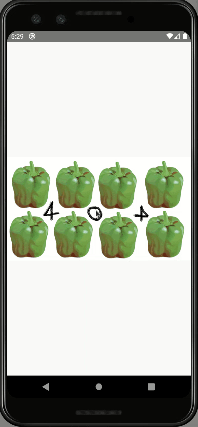

# POC: Image Pinch

It demonstrate how to implements pinch gesture on a image loaded from a server using the library [react-navigation-gesture-handler](https://github.com/software-mansion/react-native-gesture-handler).

## How to run

### Client

| Description | Command |
| :--- | :--- |
| Install dependencies | `npm install` |
| Run tests | `npm test` |
| Start Metro | `npm start` |
| Run app | `npm run android` |
| Forward localhost requests | `npm run forward` |

### Server

| Description | Command |
| :--- | :--- |
| Install dependencies | `npm install` |
| Run tests | `npm test` |
| Start server | `npm start` |

## Preview

